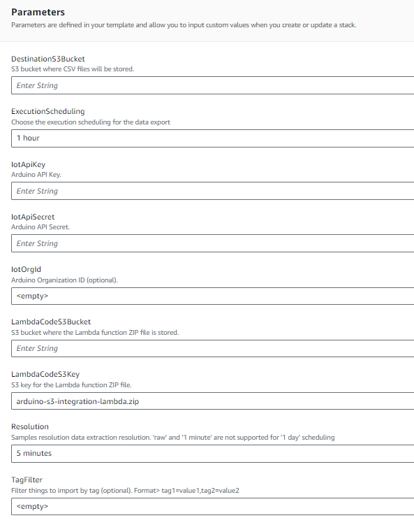

# Arduino AWS S3 CSV exporter

This project provides a way to extract time series samples from Arduino cloud, publishing to a S3 destination bucket.
Data are extracted at the given resolution via a scheduled Lambda function. Then samples are stored in CSV files and saved to S3.
By default, data extraction is performed every hour, extracting samples aggregated at 5min resolution. Non numeric values like strings are sampled at the given resolution.

## Architecture

S3 exporter is based on a Go lambda function triggered by periodic event from EventBridge.
Job is configured to extract samples for a 60min time window with the default resolution of 5min.
One file is created per execution and contains all samples for selected things. Time series samples are exported at UTC timezone.
By default, all Arduino things present in the account are exported: it is possible to filter them via [tags](#tag-filtering).

CSV produced has the following structure:
```console
timestamp,thing_id,thing_name,property_id,property_name,property_type,value
2024-09-04T11:00:00Z,07846f3c-37ae-4722-a3f5-65d7b4449ad3,H7,137c02d0-b50f-47fb-a2eb-b6d23884ec51,m3,FLOAT,3
2024-09-04T11:01:00Z,07846f3c-37ae-4722-a3f5-65d7b4449ad3,H7,137c02d0-b50f-47fb-a2eb-b6d23884ec51,m3,FLOAT,7
2024-09-04T11:02:00Z,07846f3c-37ae-4722-a3f5-65d7b4449ad3,H7,137c02d0-b50f-47fb-a2eb-b6d23884ec51,m3,FLOAT,11
2024-09-04T11:03:00Z,07846f3c-37ae-4722-a3f5-65d7b4449ad3,H7,137c02d0-b50f-47fb-a2eb-b6d23884ec51,m3,FLOAT,15
```

Files are organized by date and files of the same day are grouped.
```
<bucket>:2024-09-04/2024-09-04-10.csv
<bucket>:2024-09-04/2024-09-04-11.csv
<bucket>:2024-09-04/2024-09-04-12.csv
```

## Deployment via Cloud Formation Template

It is possible to deploy required resources via [cloud formation template](deployment/cloud-formation-template/deployment.yaml)

AWS user must have permissions to:
  * create a new CFT stack (policy: AWSCloudFormationFullAccess)
  * S3 buckets (policy: AmazonS3FullAccess)
  * IAM Roles (policy: IAMFullAccess)
  * Lambda functions (policy: AWSLambda_FullAccess)
  * EventBridge rules (policy: AmazonEventBridgeFullAccess)
  * SSM parameters (Parameter store) (policy: AmazonSSMFullAccess)

Before stack creation, two S3 buckets have to be created:
* a temporary bucket where lambda binaries and CFT can be uploaded
* CSVs destination bucket, where all generated file will be uploaded 
bucket must be in the same region where stack will be created.

Follow these steps to deploy a new stack:
* download [lambda code binaries](deployment/binaries/arduino-s3-integration-lambda.zip) and [Cloud Formation Template](deployment/cloud-formation-template/deployment.yaml)
* upload CFT and binary zip file on an S3 bucket accessible by the AWS account. For the CFT yaml file, copy the Object URL (it will be required in next step).
  


* start creation of a new cloud formation stack


* fill all required parameters.
  <br/>**Mandatory**: Arduino API key and secret, S3 bucket where code has been uploaded, destination S3 bucket
  <br/>**Optional**: tag filter for filtering things, organization identifier and samples resolution



### Configuration parameters

Here is a list of all configuration properties supported by exporter. It is possible to edit them in AWS Parameter store.
These parameters are filled by CFT at stack creation time and can be adjusted later in case of need (for example, API keys rotation)

| Parameter | Description |
| --------- | ----------- |
| /arduino/s3-importer/iot/api-key  | IoT API key |
| /arduino/s3-importer/iot/api-secret | IoT API secret |
| /arduino/s3-importer/iot/org-id    | (optional) organization id |
| /arduino/s3-importer/iot/filter/tags    | (optional) tags filtering. Syntax: tag=value,tag2=value2  |
| /arduino/s3-importer/iot/samples-resolution-seconds  | (optional) samples resolution (default: 300s) |
| /arduino/s3-importer/destination-bucket  | S3 destination bucket |

### Tag filtering

It is possible to filter only the Arduino Things of interest.
You can use tag filtering if you need to reduce export to a specific set of Things.

* Add a tag in Arduino Cloud UI on all Things you want to export. To do that, select a thing, go in 'Metadata' section and 'Add' a new tag.


* Configure tag filter during CFT creation of by editing '/arduino/s3-importer/iot/filter/tags' parameter (syntax: tag1=value1,tag2=value2).


### Building code

Code requires go v 1.22.
To compile code:

```console
foo@bar:~$ ./compile-lambda.sh
arduino-s3-integration-lambda.zip archive created
```
